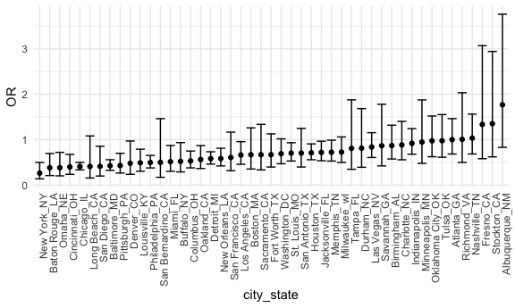
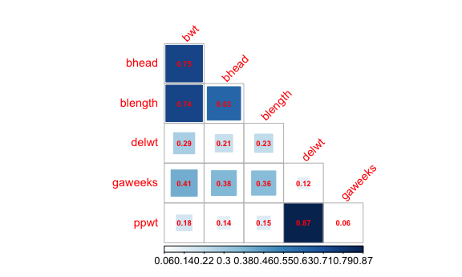
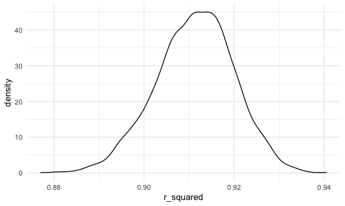
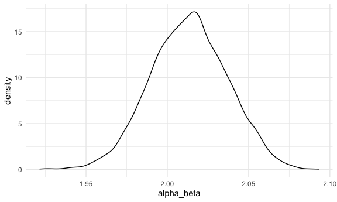

Homework 6
================

\#\#Problem 1

``` r
homicide_df = 
  read_csv("data/homicide-data.csv", na = c("", "NA", "Unknown")) %>% 
    mutate(
        city_state = str_c(city, state, sep = "_"),
        victim_age = as.numeric(victim_age),
        resolution = case_when(
        disposition == "Closed without arrest" ~ 0,
        disposition == "Open/No arrest"        ~ 0,
        disposition == "Closed by arrest"      ~ 1,
      )
    ) %>% 
  filter(
    !city_state %in% c("Tulsa_AL", "Dallas_TX", "Phoenix_AZ", "Kansas City_MO"),
    victim_race %in% c("Black", "White")    
    ) %>% 
  select(city_state, resolution, victim_age, victim_race, victim_sex)
```

Start with one city

``` r
baltimore_df = 
  homicide_df %>% 
  filter(city_state == "Baltimore_MD")

glm(resolution ~ victim_age + victim_race + victim_sex, 
    data = baltimore_df,
    family = binomial()) %>% 
  broom::tidy() %>% 
  mutate(
    OR = exp(estimate),
    CI_lower = exp(estimate - 1.96 * std.error),
    CI_upper = exp(estimate + 1.96 * std.error)
  ) %>% 
  select(term, OR, starts_with("CI")) %>% 
  knitr::kable(digits = 3)
```

| term              |    OR | CI\_lower | CI\_upper |
| :---------------- | ----: | --------: | --------: |
| (Intercept)       | 1.363 |     0.975 |     1.907 |
| victim\_age       | 0.993 |     0.987 |     1.000 |
| victim\_raceWhite | 2.320 |     1.648 |     3.268 |
| victim\_sexMale   | 0.426 |     0.325 |     0.558 |

Do it for every city in the dataset. First nest the dataset and then fit
the dataset for each city.

``` r
models_results_df =
homicide_df %>%
  nest(data = -city_state) %>% 
  mutate(
    models = map(.x = data, ~glm(resolution ~ victim_age + victim_race + victim_sex, data = .x,
                                family = binomial())),
    results = map(models, broom::tidy)
  ) %>% 
  select(city_state, results) %>% 
  unnest(results) %>% 
  mutate(
    OR = exp(estimate),
    CI_lower = exp(estimate - 1.96 * std.error),
    CI_upper = exp(estimate + 1.96 * std.error)
  ) %>% 
  select(city_state, term, OR, starts_with("CI"))
```

### Make a plot of the ORs

In each of these 50 cities are male homicide victims more or less likely
to have homicide resoled by arrest compared to female victims

``` r
models_results_df %>% 
  filter(term == "victim_sexMale") %>% 
  mutate(city_state = fct_reorder(city_state, OR)) %>% 
  ggplot(aes(x = city_state, y = OR)) + 
  geom_point() + 
  geom_errorbar(aes(ymin = CI_lower, ymax = CI_upper)) + 
  theme(axis.text.x = element_text(angle = 90, hjust = 1))
```



## Problem 2

### Part 1

Read in the data

``` r
birthweight_df = 
  read_csv("data/birthweight.csv", na = c("", "NA", "Unknown")) %>% 
  janitor::clean_names() %>%
  mutate(
    sex = case_when(
        babysex == 1 ~ "female",
        babysex == 2 ~ "male"),
    father_race = case_when(
        frace == 1 ~ "White",
        frace == 2 ~ "Black",
        frace == 3 ~ "Asian",
        frace == 4 ~ "Puerto Rican",
        frace == 8 ~ "Other",
        frace == 9 ~ "Unknown"),
    malformations = case_when(
        malform == 0 ~ "absent",
        malform == 1 ~ "present"),
    mother_race = case_when(
        mrace == 1 ~ "White",
        mrace == 2 ~ "Black",
        mrace == 3 ~ "Asian",
        mrace == 4 ~ "Puerto Rican",
        mrace == 8 ~ "Other")
  ) %>% 
  mutate(
    sex = as.factor(sex),
    father_race = as.factor(father_race),
    malformations = as.factor(malformations),
    mother_race = as.factor(mother_race)
  ) %>% 
  select(-babysex, -frace, -malform, -mrace)
```

### Part 2

## Hypothesis

I want to see what are the factors that would significantly affect
birthweight of a baby length of a baby at bith.

Step 1 - There are several other factors that confounds relationship and
for the purpose of this homework I am trying to fit the best model based
on the variables available in this dataset. Here are some of the
variables that I hypothesize based what I think are the most influencial
factors to affect the relationship between birthweight and length at
birth.

`sex`: baby’s sex (male = 1, female = 2) `bhead`: baby’s head
circumference at birth (centimeters) `blength`: baby’s length at birth
(centimeteres) `bwt`: baby’s birth weight (grams) `delwt`: mother’s
weight at delivery (pounds) `gaweeks`: gestational age in weeks
`malformations`: presence of malformations that could affect weight (0 =
absent, 1 = present) `mother_race`: mother’s race (1 = White, 2 = Black,
3 = Asian, 4 = Puerto Rican, 8 = Other) `ppwt`: mother’s pre-pregnancy
weight (pounds) `smoken`: average number of cigarettes smoked per day
during pregnancy

Step 2 - is dropping variables that are strongly associated with other
predictors (for this we check the r-squared). I know I want to keep
`sex`, `smoken`, `mother_race` and `malformations` in the model. I check
for co-linearity among other variables.

### Colinearity co-matrix

``` r
birthweight_df_cor =
birthweight_df %>%
  dplyr::select(bwt, bhead, blength, delwt, gaweeks, ppwt)

  birthweight_df_cor %>%
  cor() %>%
  corrplot::corrplot(type = "lower",
                     method = "square",
                     addCoef.col = "red",
                     diag = FALSE,
                     number.cex = .6,
                     tl.col = "red",
                     tl.cex = .9,
                     tl.srt = 45,
                     is.corr = FALSE)
```



From this model I can see that `bhead` is extremely colinear with
`blength` so I’ll remove `bhead` from the model. Similarly, `ppwt` is
colinear with `gaweeks`. I’ll remove `ppwt` from the model.

Final fitted model -

``` r
model_1 = lm(bwt ~ blength + delwt + gaweeks + smoken + mother_race + sex + malformations, data = birthweight_df) %>% 
          broom::tidy()
```

### Part 3

Describe your modeling process and show a plot of model residuals
against fitted values – use add\_predictions and add\_residuals in
making this plot.

``` r
#  birthweight_df %>% 
#  add_residuals(model_1) %>% 
#  add_predictions(model_1) %>% 
#  ggplot(aes(x = pred, y = resid)) +
#  geom_point()
```

### Part 4

Compare your model to two others:

One using length at birth and gestational age as predictors (main
effects only) One using head circumference, length, sex, and all
interactions (including the three-way interaction) between these

``` r
model_2 = lm(bwt ~ blength + gaweeks, data = birthweight_df) %>% 
          broom::tidy()

model_3 = lm(bwt ~ bhead * blength * sex, data = birthweight_df) %>% 
          broom::tidy()
```

Cross validate the three models

``` r
cv_df = 
  crossv_mc(birthweight_df, 100) %>% 
  mutate(
    train = map(train, as_tibble), 
    test = map(test, as_tibble))
```

Next I’ll use mutate + map & map2 to fit models to training data and
obtain corresponding RMSEs for the testing data.

``` r
cv_df = 
  cv_df %>% 
  mutate(
    model_1  = map(train, ~lm(bwt ~ blength + delwt + gaweeks + smoken + mother_race + sex + malformations, data = birthweight_df)),
    model_2  = map(train, ~lm(bwt ~ blength + gaweeks, data = birthweight_df)),
    model_3  = map(train, ~lm(bwt ~ bhead * blength * sex, data = birthweight_df))) %>% 
  mutate(
    rmse_1   = map2_dbl(model_1, test, ~rmse(model = .x, data = .y)),
    rmse_2   = map2_dbl(model_2, test, ~rmse(model = .x, data = .y)),
    rmse_3   = map2_dbl(model_3, test, ~rmse(model = .x, data = .y)))
```

Finally, I’ll plot the prediction error distribution for each model.

``` r
cv_df %>% 
  select(starts_with("rmse")) %>% 
  pivot_longer(
    everything(),
    names_to = "model", 
    values_to = "rmse",
    names_prefix = "rmse_") %>% 
  mutate(model = fct_inorder(model)) %>% 
  ggplot(aes(x = model, y = rmse)) + geom_violin()
```


From these plots we can see that the model with the lowers RSME is the
3rd model. The model I proposed is better than the second model, since
it has a lower RSME than the second model. Finally we should go ahead
and choose the third model.

## Problem 3

Reading in the data

``` r
weather_df = 
  rnoaa::meteo_pull_monitors(
    c("USW00094728"),
    var = c("PRCP", "TMIN", "TMAX"), 
    date_min = "2017-01-01",
    date_max = "2017-12-31") %>%
  mutate(
    name = recode(id, USW00094728 = "CentralPark_NY"),
    tmin = tmin / 10,
    tmax = tmax / 10) %>%
  select(name, id, everything())
```

Step 1. Fit the regression model Step 2. Check r-sqaured for the model
Step 3. Compute the log(β̂ 0∗β̂ 1)

``` r
#Fit regression
bootstrap_reg = lm(tmax ~ tmin, data = weather_df)

#Check r-sqaured for the model
bootstrap_reg %>% 
  broom::glance() %>% 
  select(r.squared) %>% 
  knitr::kable()
```

| r.squared |
| --------: |
| 0.9115425 |

``` r
#Compute the log(β̂ 0∗β̂ 1̂) 
bootstrap_reg %>% 
  broom::tidy() %>% 
  select(term, estimate) %>%
  mutate(
    term = case_when(
      term == "(Intercept)" ~ "intercept",
      term == "tmin" ~ "tmin")) %>% 
  pivot_wider(
    names_from = "term",
    values_from = "estimate"
    ) %>% 
  mutate( alpha_beta = log(intercept*tmin))
```

    ## # A tibble: 1 x 3
    ##   intercept  tmin alpha_beta
    ##       <dbl> <dbl>      <dbl>
    ## 1      7.21  1.04       2.01

Now build a bootstrap model for 5000 samples doing everything above.

Step 4.

``` r
bootstrap_weather_df =
weather_df %>% 
  bootstrap(n = 5000) %>% 
  mutate(models = map(strap, ~lm(tmax ~ tmin, data = .x) ),
         square = map(models, broom::glance),
         results = map(models, broom::tidy)
         ) %>% 
  select(-strap, -models)
```

step 5. produce estimates of these r-squared quantities. step 6. Plot
the distribution of the estimates Step 7. describe these in words.

``` r
dist_plot_1_df =
bootstrap_weather_df %>% 
  unnest(square) %>% 
  janitor::clean_names() %>% 
  select(r_squared)  # Step 5. produce estimates of these r-squared quantities.
  
dist_plot_1 =   
  dist_plot_1_df %>% 
  ggplot(aes(x = r_squared)) +
  geom_density()

dist_plot_1
```



Step 7 description -

step 8. produce estimates of log(β̂ 0∗β̂ 1)quantities. step 9. Plot the
distribution of the estimates Step 10. describe these in words.

``` r
dist_plot_2_df =
bootstrap_weather_df %>% 
  unnest(results) %>% 
  janitor::clean_names() %>%
  select(id, term, estimate) %>% 
mutate(
    term = case_when(
      term == "(Intercept)" ~ "intercept",
      term == "tmin" ~ "tmin")) %>% 
  pivot_wider(
    names_from = "term",
    values_from = "estimate",
    id_cols = id
    ) %>% 
  mutate( alpha_beta = log(intercept*tmin)) %>% 
  select(alpha_beta) #produced estimates of log(β̂ 0∗β̂ 1)quantities
```

Plot the distribution of the log(β̂ 0∗β̂ 1)quantitie

``` r
dist_plot_2 = 
  dist_plot_2_df %>% 
  ggplot(aes(x = alpha_beta)) +
  geom_density() 

dist_plot_2
```



Step 10 - description

Confidence Intervals for r-squared value

``` r
dist_plot_1_df %>% 
  summarize(
    ci_lower_r_squared = quantile(r_squared, 0.025), 
    ci_upper_r_squared = quantile(r_squared, 0.975)) %>% 
  knitr::kable()
```

| ci\_lower\_r\_squared | ci\_upper\_r\_squared |
| --------------------: | --------------------: |
|             0.8936977 |             0.9274807 |

``` r
dist_plot_2_df %>% 
  summarize(
    ci_lower_log_alpha_beta = quantile(alpha_beta, 0.025), 
    ci_upper_log_alpha_beta = quantile(alpha_beta, 0.975)) %>% 
  knitr::kable()
```

| ci\_lower\_log\_alpha\_beta | ci\_upper\_log\_alpha\_beta |
| --------------------------: | --------------------------: |
|                    1.966942 |                    2.058528 |
